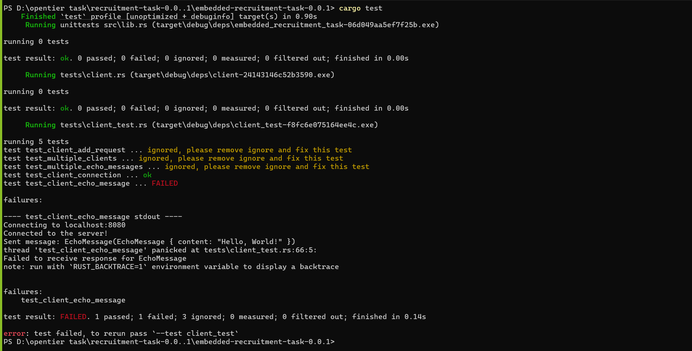
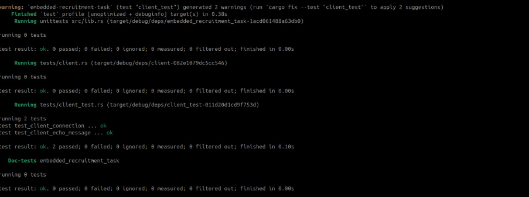

## observations  
- i have ran cargo build and that was okey and also i have ran the cargo test but it faild in the fourth test due to concurrany 

## solution 
-- Refactored server and client setup to support multithreading.
- Introduced create_server function to initialize the server with a specified port.
- Added setup_server_thread function to run the server in a separate thread.
- Implemented test_client_connection to test client connection and disconnection.
- Implemented test_client_echo_message to test sending and receiving echo messages.
- Moved client operations to client::Client module.
- Updated imports to use embedded_recruitment_task for message handling and server operations.
- Ensured proper thread management using thread::JoinHandle.
- Added assertions to verify successful client-server interactions.

